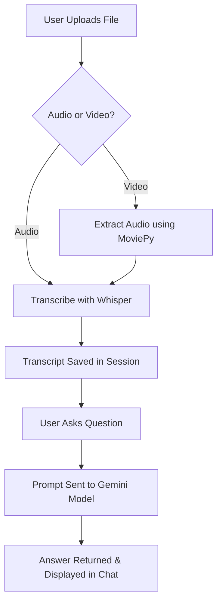

# 🎙️ Assistly - Audio/Video Q&A Chatbot

**Assistly** is a Streamlit-powered chatbot application that allows users to upload audio or video files, automatically transcribes them using OpenAI's Whisper model, and answers natural language questions using Google's Gemini 2.5 Flash model.

-----------------------------------------------------------------------------------------------------

## 🚀 Features

- ✅ Upload `.mp3`, `.wav`, `.mp4`, `.mov`, or `.mkv` files
- ✅ Automatic audio extraction from videos
- ✅ Accurate transcription using Whisper
- ✅ Chat-style Q&A powered by Gemini LLM
- ✅ Clean, responsive chat UI using Streamlit

-----------------------------------------------------------------------------------------------------

## 🧠 Architecture



---

## 📦 Requirements

Create a virtual environment and install dependencies:

```bash
pip install -r requirements.txt
```

### `requirements.txt`

```text
streamlit
whisper
moviepy
python-dotenv
google-generativeai
```

-----------------------------------------------------------------------------------------------------

## 🔧 Setup

1. **Clone the repository**

```bash
git clone https://github.com/your-username/assistly-chatbot.git
cd assistly-chatbot
```

2. **Set up `.env`**

Create a .env file in the root directory:

```env
GEMINI_API_KEY=your_gemini_api_key_here
```

3. **Ensure FFmpeg is installed**

- Download FFmpeg: https://ffmpeg.org/download.html
- Add the `bin` path to your system's `PATH` environment variable

-----------------------------------------------------------------------------------------------------

## 🧪 Run the App

```bash
streamlit run app.py
```

Then open your browser at `http://localhost:8501`

---

## 📝 Example Use Case

1. Upload a podcast or YouTube video
2. Let Assistly transcribe the audio
3. Ask questions like:
   - "What are the main topics discussed?"
   - "Who are the speakers?"
   - "Summarize the conversation."

-----------------------------------------------------------------------------------------------------

## 📄 License

MIT License © 2025 Prathap
